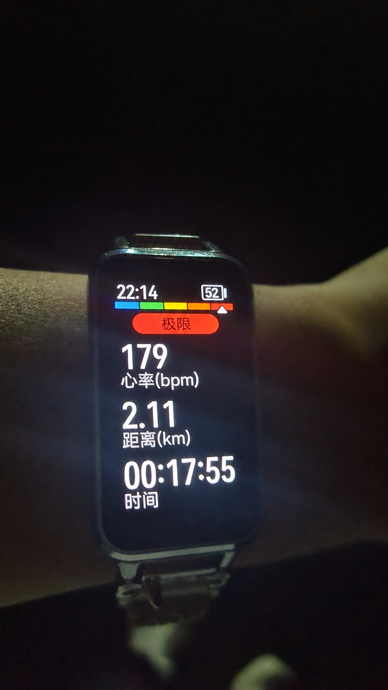

你们要高考了

愿所得皆所愿

今晚跑了2.11公里，心率179。

我想说的是

> 179，是我的极限心率；
> 211，我希望不该是你们的极限答案。

（ps: 985跑完可能会要了我的'狗'命，孩子还小，挺惜命的🙂）

作为班主任与老师，我清楚自己做得不好。

没能教给你们学识，也没能陪你们走到最后

同学们

很遗憾没能陪大家走到最后一段时光

> 这段时间能够认识你们，我始终觉得是我的幸运

你们身上有很多地方让我欣赏，你们也比自己想象中更优秀。

未来的路很长，未来的某一天回望今天，你们会发现，高考只是故事的序章。

希望你们始终拥有彼此之间的友谊，继续保持对生活的热爱，对世界的好奇，一直天真与烂漫

或许多年以后，我们已经不记得彼此的名字，但希望你们记得，在人生的某个阶段，曾经有人真心祝福过你们。

愿你们前程似锦，也愿你们永远拥有少年意气。

> 人对于旧事物的怀念是无解的
> 就像我从未真正忘记你们

我不愿去深究到底是因为喜欢你们才产生不舍

还是因为那段名为“青春”的痕迹在你们身上留下了倒影

遗憾是必然的，毕竟我们是这时代洪流中匆忙的过客。

但我转念一想，正是因为这份遗憾，才让这场相遇显得如此难能可贵

人生如逆旅，我亦是行人

绝大多数老师，最终都会成为学生人生里的过客。

绝大多数学生，也会成为老师人生里的过客。

这其实不是什么悲伤的事情。

现在之所以难受，是因为站在离别的这一端。可你终会发现人与人的关系本来就是这样。

有的人陪一辈子。

有的人陪一年。

有的人陪一节课。

有的人陪一段青春。

长度不同，不代表意义不同。

我觉得：

> 我没教给你们知识。

> 我没陪你们到毕业。

> 我没给你们留下什么。

对于你我，我们都想要'逃离'那个地方

无论发生什么，你们是我在那边感到安心的人

不知道我是否是呢，哈哈，三过七班而不入的人大抵是不配了

到底还是遗憾，或许这样才会让我铭记

对于你们来说

也许以后会忘记我的长相，忘记我的名字，忘记我讲过什么。

也许会记得：

> 高三那年，有个年轻老师。

> 不算特别厉害。

> 也不算特别成熟。

> 但挺真诚。

人很奇怪。

真正留在记忆里的，往往不是那些完美的人，而是那些真实的人。

我不是你们人生的主角。

但我也不是路边的一块石头。

我是你们故事里出现过的一页。

而你们也是我故事里的一页。

依稀记得班级最初的模样

是一个名为"全七女子班"——只有四个女生

三个是我亲手带过的试学学生

那时我们并未意识到，这间教室未来会容纳多少故事

只觉得这几张面孔，让我萌生出些许温情。

随着时间推移，从最初的四人扩张至十多人。

有人来，自然就有人走。

在那个教学质量如履薄冰的机构里

我时常对离开者的离去报以隐秘的庆幸。

这里的荒诞与无奈，

时刻在夹缝中挣扎。

命运弄人

我先一步离场

没有临别赠言，甚至连正式的告别与最后一面都显得多余。

这种仓促，不如说是为了给这段充满缺憾的经历画上一个干脆利落的句号。

现在的我，偶然会想起你们的面孔。

可已然模糊朦胧

但那又如何呢？

至少在那个五月

在那个名叫“全七”的盛夏

我们确实存在过。

我祝愿你们即便身处考场的严苛

也能获得片刻的无忧无虑

至于我自己，常会陷入某种近乎傲慢的空想：

> 若有朝一日，我羽翼丰满，不再受困于世俗的粗糙，是否能为你们撑开一片真正的庇护所？

我知道，这不过对自己那点仅存的理想主义进行的浪漫修饰

聚散总有时

你们会迎来你们的美好

我也会有我自己的生活。

青春本来就是这样。

像列车在深夜经过一个小站。

有人上车，有人下车。

没有人能陪谁坐完整趟旅程。

但不能因为列车开走了，就说那个站不存在。

所以真要把这种心情写进博客里，我反而会写一句：

> 我只是你们人生中的一个过客。

> 但能在你们最美好的年纪认识，已经足够让我铭记很多年。

真的羡慕你们（真心的）

我没有自怜，也没有把自己看得太重。

只是平静地承认：

**有些缘分，不是为了同行一生，而是为了彼此短短相伴的那些时刻。**

如果要问我们还能再见面吗？

大概会吧，但再见面就要靠运气了。

这个世界太大了，大到如果不刻意去制造重逢，人与人之间就真的再也见不到了。

所以，接下来的路

我们要去往不同的方向了。

也许此生再难见一面，但我依然会记得翻看过往的记忆。

珍重。