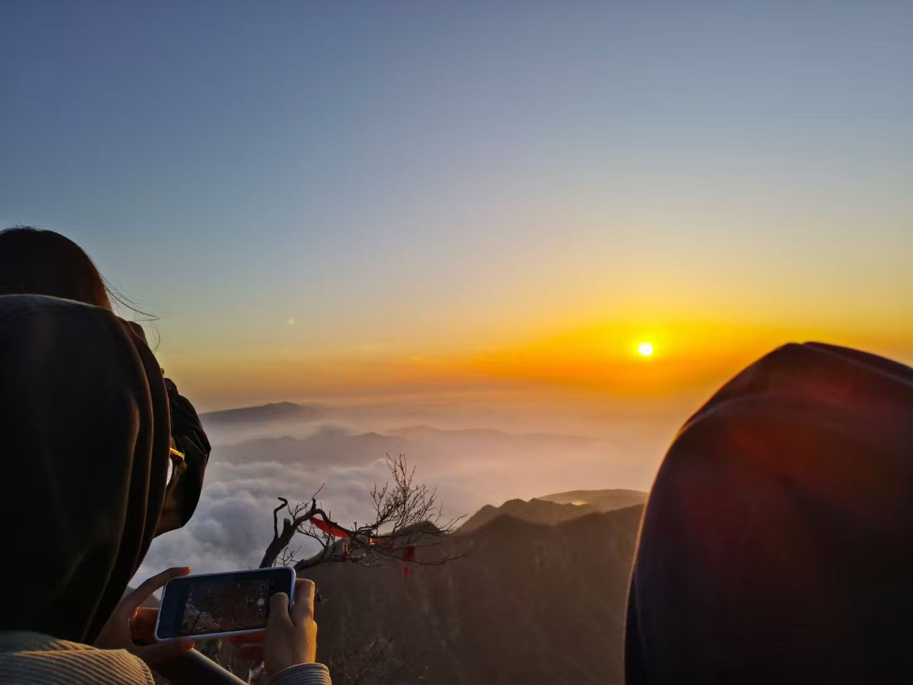
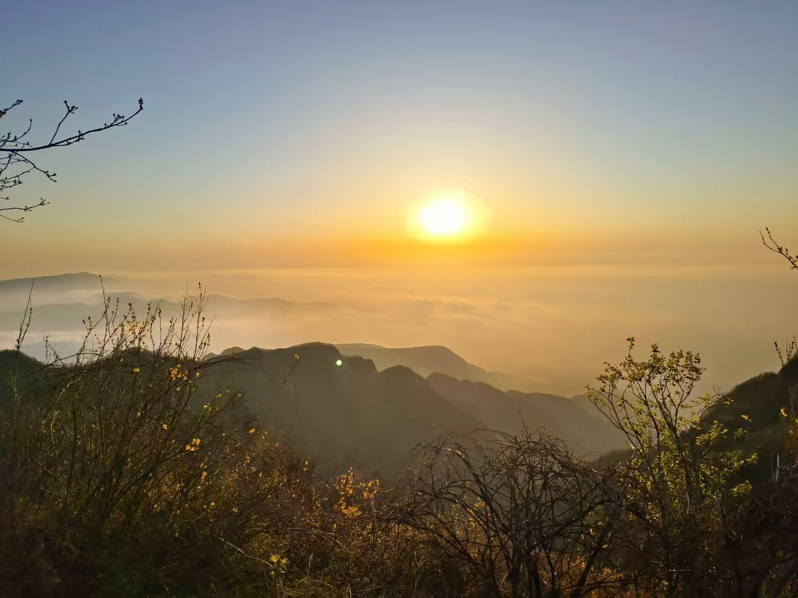
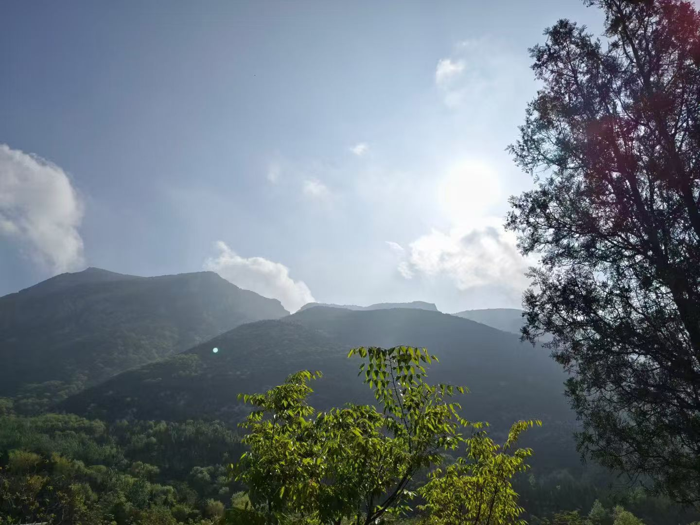

## 朋友圈: 突如其来的念头

刷朋友圈时，看到一位好友分享了登嵩山的照片。

心里一动，我也立刻发微信说想去。

没想到，两天后他就告诉我：有个团定在 4 月 12 日夜爬嵩山，门票 29 元。他还特地叮嘱我要带上厚衣服和手电筒，其他的都交给他来安排。

这次同行的，还有另一位高中同学。我们在傍晚七点多于指定地点汇合。

等车的时候，忍不住买了一根烤肠垫肚子。

嵩山在登封，离郑州并不远。车上小睡了一会儿，醒来时天色已黑，车窗外只剩近处的昏黄灯光和远处的万家灯火。

抵达山脚已是深夜十点多。旅行团给每人发了登山杖和小手电，塑料手电亮度不佳，但聊胜于无。

到了检票口 简单补充了些水和食物，上个厕所，算是做好准备。十一点，队伍分批进入检票口。因为要检查保险，我们干脆混在人群里悄悄进去了。

## 烤肠：途中小满足

夜爬嵩山的路程大约三个小时。我们不急不躁，

途中看到卖烤肠的摊子，朋友每人买来一根。

平时我对烤肠兴趣不大，但这次烤肠是真的觉得很好吃，甚至产生以后每次爬山都该来上一根的想法。

## 半山休憩：月光下的邂逅

一点左右，我们爬到半山腰，在一个平台稍作休息。

旁边有几位女生，我那位外向的朋友能搭起话，聊得热络，最后还留下了合影。

歇息够了，继续上路。

## 山顶寒风：黎明前的黑暗

三点左右，我们终于抵达山顶。时间尚早，但山顶早已人头攒动。

我们在一处废弃的房子里探索一圈，最后找了个台阶坐下休息。

夜里的嵩山非常寒冷，刚开始因为爬山还觉得没什么，慢慢的身体越来越冷，身体也自觉地蜷缩。

山风阵阵吹过，幸好穿了冲锋衣，不然怕是熬不过这三个小时。

## 云海现：意料之外的惊喜

等待的辛苦，最终换来了绝美的回报——翻涌的云海在晨光下铺展开来，波澜壮阔，令人屏息。

那一刻，所有的疲惫都烟消云散。只有对自然美景的赞叹！

照片虽远不及眼中所见，却仍让我心满意足。

## 晨光归途：旅程的收束

下山时，检票口附近已有早餐摊。简单吃了些东西，便走向返程的发车点。

记不清我们究竟是走哪一条道下山的，只记得宽阔的道路上还有观光车载着游客离开。

天空格外明媚，晨光透彻且温柔。块块云朵飘着，舒展在天际。

宣告这趟旅途的结束！

---

